# Presentation Essay on the Algorithms and Constructs of `sba-proj`
### A Full-Stack Opera Ticket Booking System (HKDSE ICT SBA — Option C: Algorithm & Programming)

**Author of the essay:** Clifford,Wu Jia An

**Diagram notation:** algorithms are described by Mermaid flowcharts.

---

## 1. Introduction and Project Context

The project is a **full-stack web-based Opera Ticket Booking System**: users sign up (with email verification), browse and search a catalogue of operas, filter and sort the results with hand-implemented sorting algorithms, pick a seat class and ticket quantities, pay through a simulated wallet, and later view or refund their orders. The server is a Node.js/Express application backed by PostgreSQL, and the front end is a set of static HTML/JS pages.

The project was built for the Hong Kong Diploma of Secondary Education (HKDSE) ICT School-Based Assessment under **Option C (Algorithm and Programming)**, whose brief (`Descriptions/guidelines.pdf`) asks for a **Booking System** with at least three modules and 10–15 resources, and requires:

| Guidelines requirement | Where this essay covers it |
| :--- | :--- |
| Task 1(a) — suitable data types & data structures                     | §2 (schema, tables, JS structures), §5 |
| Task 1(b) — searching and displaying events                           | §4.1–4.4 (Levenshtein fuzzy search, ranking, sorting, pagination) |
| Task 1(c) — booking, seat/time-slot selection, payment simulation     | §5, §6 (dynamic pricing, wallet transaction) |
| Task 1(d) — stepwise refinement of the main menu loop & key features  | §2.4 (user-journey flowchart), plus a flowchart per feature |
| Task 1(e) — flowcharts for the algorithms in (d)                      | every Mermaid flowchart in this essay |
| Task 2 — testing & evaluation                                         | §8 (debugging, marginal cases, portability, feature extension) |

The developer’s own planning notes (`presentation.md`) list exactly the topics this essay formalises: the flowchart and ER diagram, SQL, `localStorage` parameter passing, **hash & salt** authentication, the five **sorting algorithms** (bubble, selection, insertion, merge, quick), **fuzzy search via Levenshtein distance**, keyword detection, `+ − × ÷` arithmetic in ticket-price calculation, `console.log()` error tracking, and the marginal case `wallet balance < order price`.

---

## 2. System Architecture and Core Constructs

### 2.1 Modular architecture (construct: *separation of concerns*)

The backend was refactored on 6 Aug 2026 (see `Descriptions/Log.md`) from a single `serv.js` into a **central router plus four modules**. Each module is an ES-module (`"type": "module"` in `back-end/package.json`) exporting an Express router:

| Module | Responsibility | Key algorithms / constructs inside |
| :--- | :--- | :--- |
| `serv-config/serv-config.js` | PostgreSQL connection pool, API keys | environment configuration |
| `serv-utils/serv-utils.js` | pure helper functions | salted SHA-256 hash, token & ID generation, `getPricePlan()`, mail templates |
| `serv-auth/serv-auth.js` | signup / login / verification / password reset | salted hashing pipeline, token lifecycle, `BEGIN…COMMIT/ROLLBACK` |
| `serv-main/serv-main.js` | catalogue, pricing, payment, refund, gift codes | ACID payment transaction, `FOR UPDATE` locking, ledgering |
| `serv.js` | entry point: mounts both routers | middleware `cors()`, `express.json()` |

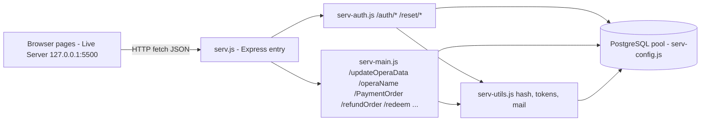

The front end mirrors this: each page has its own script, and the sorting algorithms live in a dedicated utility module `front-end/search/sort.js` that `search.js` imports via `import * as sort from './sort.js'`.

### 2.2 Database design: 3NF normalisation and the full ER diagram

The schema (`back-end/user.sql`) was redesigned on 1 July 2026 to fix **Third Normal Form (3NF)** violations. Data is split into eleven tables so that no non-key column transitively depends on another non-key column: account data (`user_infor`), balance (`wallet`), money movement (`wallet_transaction`), promo codes (`gift_code`), two token tables (`email_verification`, `pwd_reset`), catalogue (`opera`), price plans (`prices`), seat-class multipliers (`lv`), orders (`orders`) and tickets (`ticket`).

Notable **constructs** (not algorithms, but deliberate design decisions):

* **Primary keys / foreign keys** with `ON DELETE CASCADE` — referential integrity is enforced by the DBMS.
* **Check constraints** as an algorithmic backstop: `CHECK (balance >= 0)`, `CHECK (amount > 0)`, `CHECK (tx_type IN ('CREDIT','DEBIT'))`, `CHECK (rate <= 10.0)`.
* **Secondary index** `idx_wallet_tx_uid_date ON wallet_transaction(uid, created_at DESC)` to speed up ledger lookups.
* **`SERIAL` surrogate keys** (`uid`, `order_id`, `ticket_id`…) so business columns remain free to change.

The complete ER diagram below is derived from `user.sql` and shows **every table, every column, and every foreign-key relation**. FK columns are marked `FK` inside the owning table, and each relation line is labelled with the FK column that carries it.

**RefersTo:** 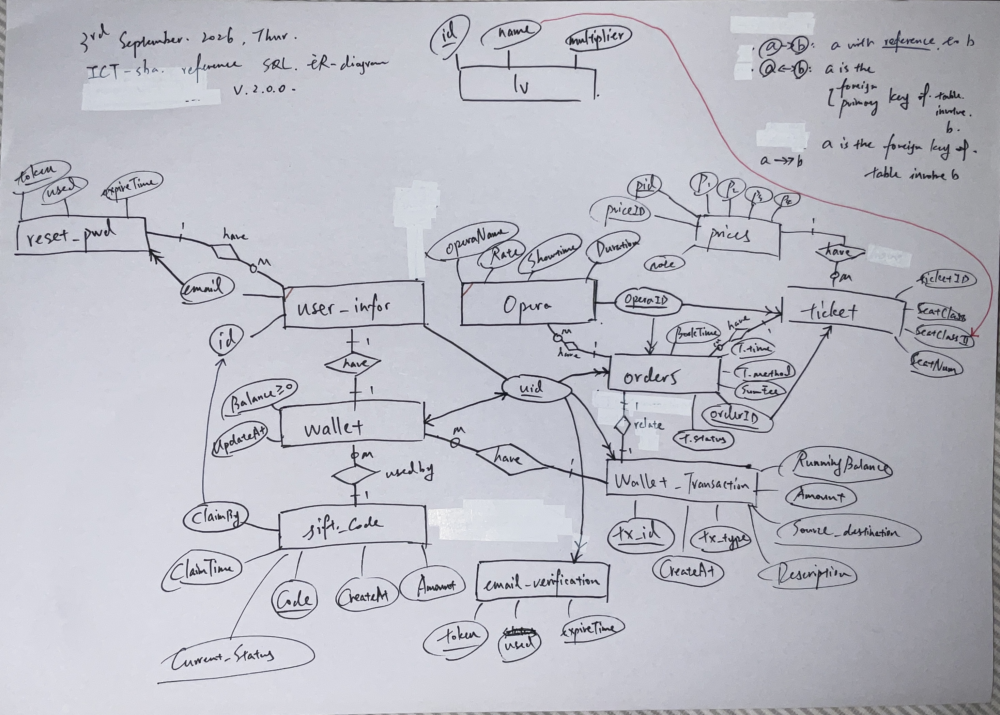

`lv` is a pure lookup table (name → multiplier) with **no foreign key**; the book page reads it at runtime to price adult/student/wheelchair tickets (§5.2).

### 2.3 Data structures in the running program

| Structure | Concrete form | Where |
| :--- | :--- | :--- |
| 2-D array | Levenshtein DP matrix | `search.js` `levenshtein()` |
| Array / list | opera list `Final`, sorted in place | `search.js`, `sort.js` |
| Hash map | `operaMap` grouping rows by `opera_id` | `serv-main.js` `/updateOperaData` |
| Object / record | `details` object passed between pages | `book.js`, `pay.js` |
| JSON serialisation | `localStorage.setItem('details', JSON.stringify(details))` | `book.js` |
| Stack (implicit) | recursion call stack in quick sort | `sort.js` |
| Queue (implicit) | browser event queue via `setInterval` | `pay-mediator.js` |
| Relational tables | the 11 PostgreSQL tables above | `user.sql` |

**Cross-page parameter passing** (a construct called out in `presentation.md`) is done with `localStorage` keys: `search_content`, `selected`, `selected_price_id`, `selected_time`, `details`, `user`, `isLoggedIn`, `orderId`, `tickets`. This is a key-value store: write with `setItem`, read with `getItem`, remove with `removeItem` (`main.js` logout).

### 2.4 The main flow (stepwise refinement of the “menu loop”)

The system has no console menu; its “main menu loop” is the page navigation graph, refined step-by-step in `Log.md` across May–August 2026:

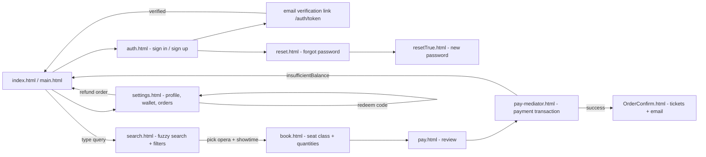

---

## 3. Authentication and Security Constructs

### 3.1 Salted SHA-256 password hashing

Passwords are never stored in plain text. `serv-utils.js:13-15` computes a single-pass digest `SHA256(pwd ‖ salt)` in hex. On sign-up, a fresh 16-byte random **salt** (32 hex characters from `crypto.randomBytes(16)`) is generated per user, so two users with the same password produce different digests (defeating rainbow-table attacks). On login, the stored salt is fetched and the same digest is recomputed and compared.

> **Precision note:** `README.md` calls this “PBKDF2”. The actual implementation is a **single-pass salted SHA-256 digest** — the correct description is the one in `presentation.md`: “hash & salt”. This discrepancy is picked up again in §8.4.

**Sign-up pipeline** — `serv-auth.js:18-60`:

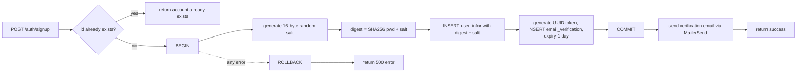

**Login verification** — `serv-auth.js:87-119`:

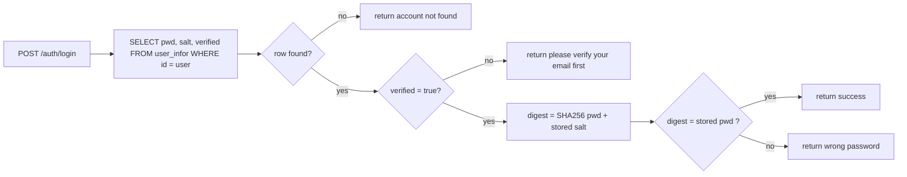

### 3.2 Password-strength validation (the five rules)

`auth.js` `valid_check()` (`front-end/auth/auth.js:77-94`) implements the rules listed in `presentation.md`. The construct worth noting is that it **accumulates all failing rules** (filter + map over a rule table) instead of failing on the first error, so the user sees every unmet requirement at once:

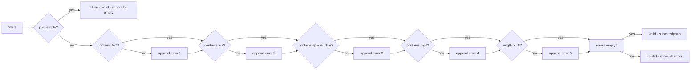

### 3.3 Token-based email verification and password reset

Both pipelines share one construct: a **cryptographically random single-use token with an expiry timestamp**, stored in its own table and checked with a guarded transaction:

| Property | Email verification | Password reset |
| :--- | :--- | :--- |
| Token source | `crypto.randomUUID()` minus hyphens (128-bit) | same |
| Table | `email_verification` | `pwd_reset` |
| Expiry | `NOW() + INTERVAL '1 day'` | `NOW() + INTERVAL '15 minutes'` |
| Single-use | `used BOOLEAN DEFAULT FALSE` | same |
| Race protection | check `used = FALSE` | `SELECT … FOR UPDATE` + `used = FALSE` |
| Side effect | `verified = TRUE`, wallet row created (`ON CONFLICT DO NOTHING`) | new salt + new digest stored |

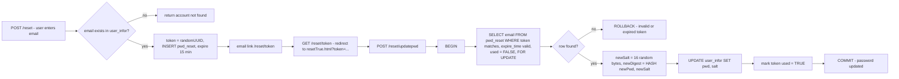

---

## 4. Search and Sorting — the Algorithm Core

### 4.1 Fuzzy search: Levenshtein edit distance (dynamic programming)

Requirement: users should find an opera even with typos (“carnen” must find “Carmen”). The solution in `front-end/search/search.js:61-89` is the classic **Levenshtein distance** computed by **dynamic programming** over an `(m+1) × (n+1)` integer matrix — the 2-D array explicitly flagged in `Descriptions/progressList.md`. The allowed edits are insertion, deletion and substitution, each costing 1.

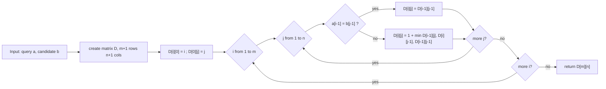

Complexity: **O(m·n) time and O(m·n) space**. No transposition step is implemented (true Levenshtein, not Damerau), which matches the coursework scope.

**Worked example** — query `carnen` against candidate `carmen` (one substitution ⇒ distance 1):

| D | ∅ | c | a | r | m | e | n |
| :--- | ---: | ---: | ---: | ---: | ---: | ---: | ---: |
| **∅** | 0 | 1 | 2 | 3 | 4 | 5 | 6 |
| **c** | 1 | 0 | 1 | 2 | 3 | 4 | 5 |
| **a** | 2 | 1 | 0 | 1 | 2 | 3 | 4 |
| **r** | 3 | 2 | 1 | 0 | 1 | 2 | 3 |
| **n** | 4 | 3 | 2 | 1 | 1 | 2 | 3 |
| **e** | 5 | 4 | 3 | 2 | 2 | 1 | 2 |
| **n** | 6 | 5 | 4 | 3 | 3 | 2 | **1** |

Two implementation details matter for correctness: the query is lower-cased and trimmed, and the candidate is the **slug** (`opera_name` lower-cased with spaces replaced by `-`, e.g. `la-traviata`), so a space in the user’s query costs one substitution — a deliberate, documented simplification.

### 4.2 Keyword detection and relevance ranking (exact-match-first)

`AccordingToSearchBar()` (`search.js:204-218`) combines the two ideas named in `presentation.md` (“keyword detecting” + “fuzzy search”): exact substring matches are forced to weight `-1`, so they outrank every fuzzy match; among fuzzies, smaller edit distance = higher relevance. Ranking is a classic **sort-by-computed-key** problem.

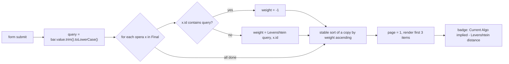

`Log.md` (29 July 2026) records that a **quick sort was applied to rank the weights**; the code wired into the page today delegates to the engine’s built-in stable `Array.prototype.sort` (Timsort in V8), while `sort.js` retains three purpose-built quick-sort implementations (§4.3.5) — `quick_v1()` in particular is the exact “rank weighted elements descending” sorter the log describes. Edge case: an empty query gives every item weight `-1`, and the stable sort then preserves the original catalogue order — a sensible “show everything” behaviour.

### 4.3 The five classic sorting algorithms (`front-end/search/sort.js`)

`Descriptions/in_syllabus_list.txt` names the required syllabus sorts — *bubble, selection, insertion, merge* — and the project adds *quick*, exactly the five listed in `presentation.md`. Each lives in `sort.js` as a pure function, and each has its own flowchart below. The page wires one sort per filter radio (`search.js:286-310`):

| Filter radio | Algorithm wired | Function | Order |
| :--- | :--- | :--- | :--- |
| name | merge sort (case-insensitive) | `merge_name()` | A→Z |
| time | insertion sort (adaptive) | `insertion_time()` | earliest→latest |
| price | bubble sort (early-exit) | `bubble_ascending_price()` | cheapest→dearest |
| rate | bubble sort (early-exit) | `bubble_ascending_rate()` | highest rating first |

#### 4.3.1 Bubble sort — with an early-exit flag

Adjacent elements are compared and swapped, bubbling the largest element to the end of each pass. A `swapped` flag turns the best case into **O(n)** (early exit on sorted input); worst/average remain ***O(n²)***. It is **stable** and in-place (***O(1)*** extra space). Note that `bubble_ascending_rate()` uses the mirrored predicate, so despite its name it sorts **descending** — highest rating first, which is the desired UX.

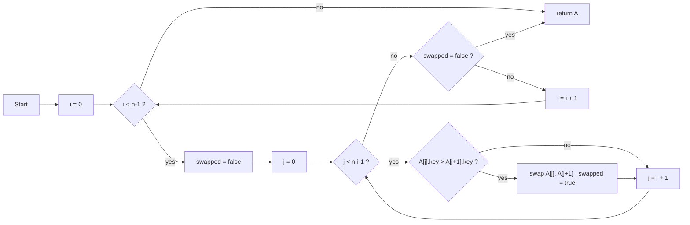

#### 4.3.2 Selection sort — smallest-first, by repeated minimum search

Each pass finds the minimum of the unsorted suffix and swaps it into place. Always **O(n²)** comparisons, **O(n)** swaps, **unstable**, in-place. It is implemented for syllabus completeness; the current UI does not call it (see §8.4).

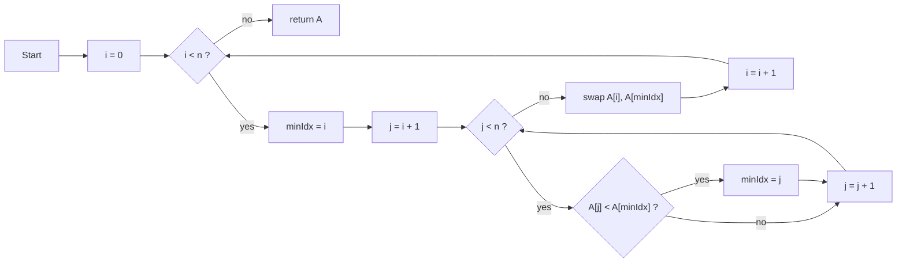

#### 4.3.3 Insertion sort — adaptive, used for show times

Each element is inserted into the sorted prefix by shifting larger elements one position right. **Adaptive**: O(n) on nearly-sorted input, O(n²) worst case; **stable** and in-place. `insertion_time()` compares `show_time` fields; because the stored timestamps are ISO-8601 strings, lexicographic comparison equals chronological comparison — a neat, correct choice of representation that avoids `Date` parsing inside the loop.

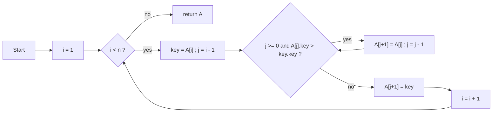

#### 4.3.4 Merge sort — iterative (bottom-up) divide-and-conquer

Instead of the textbook recursive version, the project uses the **bottom-up** form: merge adjacent runs of width `1, 2, 4, 8, …` until the whole array is one run. Guaranteed **O(n log n)** in all cases, **stable**, but uses **O(n)** auxiliary space for the slices. The bottom-up variant avoids recursion depth issues entirely — relevant because the same file’s quick sort *does* recurse. `merge_name()` keys on `id` with `localeCompare(…, {sensitivity: 'base'})`, i.e. case-insensitive alphabetical order.

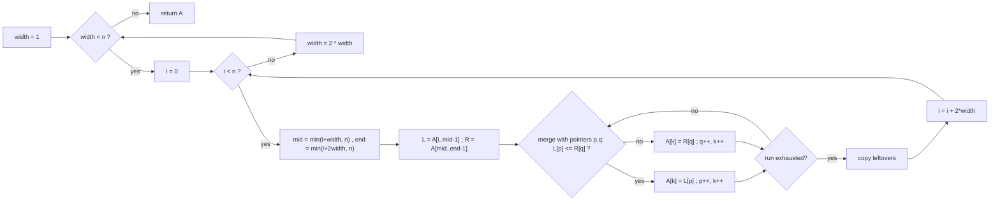

#### 4.3.5 Quick sort — three variants with median-of-three pivoting

The file contains three quick sorts, all choosing the pivot by the **median-of-three** rule (first / middle / last) to avoid the classic O(n²) trap on sorted input:

* **`quick()`** (`sort.js:158-177`) — out-of-place version that picks the pivot *by value* with a `median()` helper.
* **`quick_v1()`** (`sort.js:179-207`) — the Levenshtein-weight ranker: sorts DOM elements **descending** by a numeric weight stored in `dataset.data`. The median value is computed arithmetically — *sum of the three values minus the maximum minus the minimum equals the middle value* — so no helper function is needed.
* **`quick_v2()`** (`sort.js:209-247`) — the production-grade **in-place** variant: swap the pivot to the front, advance `i` from the left over elements `< p`, retreat `j` from the right over elements `≥ p`, swap inversions, and finally place the pivot at `j` before recursing on both sides.

Complexity: **O(n log n)** average, **O(n²)** worst (median-of-three makes the bad case unlikely), **unstable**, **O(log n)** recursion stack in the in-place variant. The call stack is the implicit *stack* data structure of the syllabus list.

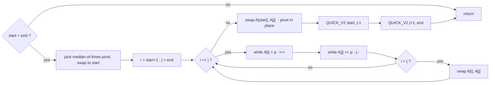

### 4.4 Pagination (windowed rendering)

`renderPage()` (`search.js:184-203`) implements fixed-size pagination — a classic array-windowing construct with boundary clamping:

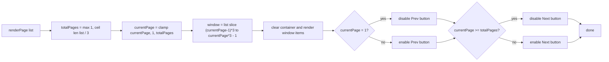

The ← / → arrow keys trigger the same handlers (`search.js:248-256`), so the page is navigable by keyboard.

---

## 5. Dynamic Pricing and Ticket Arithmetic

`presentation.md` flags the “+-*/ arithmetic calculation in sum ticket price calc”. The pipeline has three layers:

### 5.1 Time-based price plan — `getPricePlan()` (`serv-utils.js:122-136`)

Each opera has two price plans; the plan is chosen by the **show time** (after the 8 Aug 2026 fix, from the opera’s schedule rather than system time). Time is converted to seconds since midnight by `H × 3600 + M × 60 + S` and compared against the 12:00:00 threshold of 43 200 seconds.

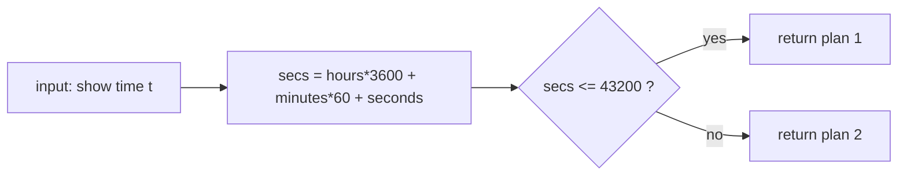

**Boundary case:** the comparison `≤ 43200` means exactly `12:00:00` still selects Plan 1, and `12:00:01` switches to Plan 2 — an off-by-one test point for §8.

### 5.2 Seat-class multipliers and the total-price formula (`book.js`)

The database `lv` table stores multipliers per audience type (adult / student / wheelchair). The book page computes per-ticket prices and the total `sum_fee = nA·pA + nS·pS + nW·pW`, where each `px = base × multiplier(type)`:

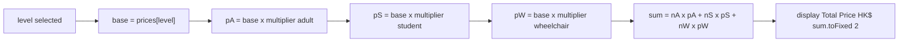

The quantity steppers clamp at zero (`minus` only decrements while `currentVal > 0`, `book.js:158-160`) — another marginal case handled at the UI level. The result object is serialised to `localStorage['details']` and later consumed by `pay.html` and the backend `PaymentOrder`.

---

## 6. Payment, Wallet and Concurrency Constructs

### 6.1 The ACID payment transaction — `/PaymentOrder` (`serv-main.js:191-239`)

This is the centrepiece construct of Task 1(c). A single order touches five tables, so the backend wraps everything in one SQL transaction (`BEGIN … COMMIT / ROLLBACK`), satisfying **Atomicity**: either all five writes happen, or none.

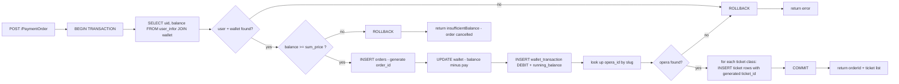

### 6.2 Pessimistic locking — `SELECT … FOR UPDATE`

For the money-sensitive single-resource rows the project uses **row-level pessimistic locking**: a `FOR UPDATE` lock makes a concurrent transaction wait until the first one commits, eliminating lost-update races. The lock appears in the current code at three points:

* **Password reset consumption** — `pwd_reset` row locked while being consumed (`serv-auth.js:149`).
* **Gift-code redemption** — the `gift_code` row is locked before the `current_status` check (`serv-main.js:117`), so two users cannot both redeem the same code (double-spend protection).
* **Refund** — the `orders` row is locked before re-checking `transac_status = 'COMPLETED'` (`serv-main.js:56-63`), so a double-click cannot refund the same order twice.

`README.md`/`Log.md` describe the same design intent for the purchase path; the current `/PaymentOrder` implementation instead relies on transaction isolation plus the database **CHECK constraint `balance ≥ 0`** as a backstop (an overdraft would raise an error → `ROLLBACK`). Both mechanisms are worth describing in the report: the general lock–validate–mutate pattern, and where each row is protected.

### 6.3 The refund pipeline (`serv-main.js:52-111`)

Added on 8 Aug 2026 as the Task-2 extension; it reverses a whole order (documented limitation: whole orders only, not single tickets):

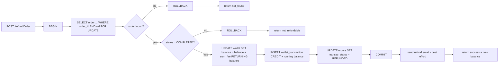

The front-end `settings.js` additionally filters out `REFUNDED` orders from the list and disables re-refund buttons.

### 6.4 Gift-code redemption (`serv-main.js:112-143`)

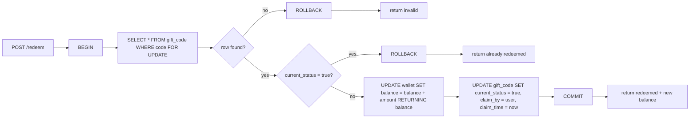

---

## 7. Utility Algorithms and Generators

### 7.1 Random identifier generation

**Verification / reset tokens** (`serv-utils.js:17-30`) use the platform CSPRNG: `crypto.randomUUID()` (a v4 UUID, 122 random bits) with hyphens stripped — collision-safe and unguessable.

**Ticket IDs** (`serv-utils.js:155-162`) combine a timestamp with two random base-36 blocks, with **recursive collision retry** — recursion used as a bounded loop (the two blocks are compared, so a retry is vanishingly rare):

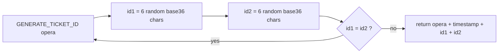

**Gift codes** (`toolkit.js:8-13`) are 4-4-4 blocks over a 36-symbol alphabet (format matches the schema comment “4+1+4+1+4 = 14”):

```mermaid
flowchart LR
    A[GENERATE_GIFT_CODE] --> B["chars = 0-9A-Z, 36 symbols"]
    B --> C["block = 4 random picks from chars"]
    C --> D["repeat 3 times"]
    D --> E["return block-block-block"]
```

Note: `Math.random()` is a PRNG, acceptable for coursework, though a CSPRNG would be the hardened choice for value-bearing codes (§8.4).

### 7.2 Hash-map aggregation — `/updateOperaData` (`serv-main.js:145-171`)

The SQL returns one row per (opera, price plan). The server folds them into nested objects in **O(n)** using a hash map keyed by `opera_id`, and derives the search slug (`lowercase`, spaces → `-`):

```mermaid
flowchart LR
    A["input: SQL rows"] --> B["map = empty hash map"]
    B --> C{for each row}
    C --> D{"row.opera_id in map?"}
    D -- no --> E["create entry id = slug name, plans = empty"]
    E --> F["append plan to map[opera_id].plans"]
    D -- yes --> F
    F --> C
    C -- all done --> G["return values map"]
```

The same slug function (`LOWER(REPLACE(opera_name,' ','-'))`) is re-applied in SQL on the lookup side (`serv-main.js:177,215`), keeping front-end ids and database rows aligned.

### 7.3 Micro-constructs

* **Modulo cycling** for the “processing…” animation (`pay-mediator.js:14`): `index = (index + 1) % texts.length` — a ring buffer over three strings.
* **Order breakdown aggregation** in `settingsGetOrders`: SQL `GROUP BY` + `json_agg(json_build_object(...))` produces the per-class ticket counts without N+1 queries.
* **Zero-padding** for timestamps: `String(n).padStart(2,'0')` (`serv-utils.js:141-146`).

---

## 8. Testing and Evaluation (Guidelines Task 2)

### 8.1 Debugging strategy

As planned in `presentation.md` (“console.log() in back-end server for error tracking”), the backend routes log every significant transition (`Log.md`, 24 July 2026), e.g. `route entered`, `token:`, `wallet successfully generated`, `redirected!`. This trace-driven debugging found the 24 July bug where the emailed verification link pointed at port `5500` (Live Server) instead of port `3000` (Express) — fixed by computing URLs from the configured `BACKEND_URL`.

### 8.2 Marginal and boundary cases

| Case | Expected behaviour | Where enforced |
| :--- | :--- | :--- |
| `wallet.balance < order price` | transaction rolled back, message `insufficientBalance`, user returned to home | `serv-main.js:201-204` (the case named in `presentation.md`) |
| Double refund / refund after refund | `not_refundable` | status re-check under `FOR UPDATE` |
| Same gift code redeemed twice | `already redeemed` | status check under `FOR UPDATE` |
| Expired or used reset token | `Invalid or expired token` | `expire_time > NOW()` and `used = FALSE` |
| Unverified account logs in | `Please verify your email first` | `serv-auth.js:96-98` |
| Ticket quantity minus at 0 | value stays at 0 | `book.js:158` |
| Price plan at exactly 12:00:00 | Plan 1 (≤ 43200); 12:00:01 → Plan 2 | `serv-utils.js:131` |
| Pagination at first / last page | Prev/Next disabled; page index clamped | `search.js:188-202` |
| Empty search box | all weights equal, stable order = original catalogue | `search.js:207-215` |

### 8.3 Portability and the feature-extension route (Task 2(ii))

A first online deployment attempt on 4–5 Aug 2026 (Vercel) failed, documenting the portability limits between a local PostgreSQL database and a cloud host; the code keeps `isLocal` switches that swap `http://127.0.0.1:3000` for the hosted URL. Following testing feedback, the scope was extended on 8 Aug 2026 with the **full-order refund** feature (§6.3) — a concrete “describe how the scope could be extended and implement it” response to Task 2. A system test of the full user journey (registration → verification → search → booking → payment → confirmation) is recorded in `demo.mp4`, with the pre-verified test account `alpha` / `Aa714714!` provided for evaluators.

### 8.4 Findings from the code review (further debugging / optimisation points)

These are honest observations for the evaluation section — evidence that the code was actually tested rather than merely described:

1. **`quick()` calls an undefined helper.** `sort.js:164` calls `median(first, mid, last)`, but no `median` function exists anywhere in the front end — invoking `quick()` throws `ReferenceError`. The working variants `quick_v1`/`quick_v2` compute the median-of-three arithmetically instead.
2. **Selection sort and the “avail” filter are unwired.** `selection()` is exported but never called by `search.js`, and the `FilterStatus_avail` radio has no matching branch in its change handler — `presentation.md`’s claim that all five sorts filter the catalogue is aspirational relative to the wired code (four are wired: bubble ×2, insertion, merge).
3. **Sign-up confirm-password check reads the wrong element.** `auth.js:117` reads `signupSubmit.value` — but `signupSubmit` is the `<form>`, which has no `value`, so the client-side confirm check throws a `TypeError` before reaching `valid_check()`. The intended element is `signup_pwd_confirm`.
4. **Documentation vs implementation on hashing.** `README.md` says PBKDF2; the code is single-pass salted SHA-256 (§3.1). Either upgrade the code to PBKDF2/scrypt (better), or correct the document.
5. **`Math.random()` for gift codes and transaction IDs** is a non-cryptographic PRNG; `crypto.randomUUID()` (already used for tokens) would be the safer choice for value-bearing identifiers.
6. **Session state lives in `localStorage` only.** `isLoggedIn` is client-writable and the payment endpoint trusts the username in the request body; adding a server-side session token would harden the system. This is a known scope simplification, not an algorithmic flaw.
7. **Login digest comparison uses `===`**, which is not constant-time; with a strong salt this is low-risk here, but `crypto.timingSafeEqual` is the standard fix.

---

## 9. Conclusion and Mapping Back to the Guidelines

The project answers every clause of the Option C brief with recognisable, nameable computer science, and each item maps to source:

* **Data types & structures (Task 1a):** SQL tables in 3NF with PK/FK/CHECK/CASCADE constraints, the 2-D DP matrix, hash-map aggregation, JSON objects, `localStorage` — §2.
* **Searching & display (Task 1b):** Levenshtein fuzzy search with exact-match-first ranking, four wired sorting algorithms, windowed pagination — §4.
* **Booking / seat selection / payment simulation (Task 1c):** seat-class multipliers, time-based price plans, quantity arithmetic, ACID wallet transaction with ledgering, refunds and gift codes — §5, §6.
* **Stepwise refinement (Task 1d) and flowcharts (Task 1e):** the page-level main flow and one flowchart per key algorithm are given throughout this essay.
* **Testing & evaluation (Task 2):** console-log debugging, the documented marginal cases (especially `walletBal < orderPrice`), the failed deployment as a portability study, and the refund feature as scope extension — §8.

The syllabus list (`in_syllabus_list.txt`) also mentions *stack, queue, linked list*: the project exercises the **stack** implicitly through quick-sort recursion and the **queue** through the browser’s event loop (`setInterval` in the payment mediator), while linked lists are not needed by any part of the design — an honest trade-off worth stating at the presentation.

**Summary of algorithmic complexity (appendix):**


| Algorithm            | Location             | Best / Average / Worst time        | Space         | Notes                                   |
| :---                 | :---                 | :---                               | :---          | :---                                    |
| Levenshtein distance | `search.js:61`       | $O(mn)$ / $O(mn)$ / $O(mn)$        | $O(mn)$       | full-matrix DP                          |
| Relevance ranking    | `search.js:204`      | $O(n \log n)$                      | $O(n)$        | stable engine sort on computed weights  |
| Bubble sort          | `sort.js:20,33`      | $O(n)$ / $O(n^2)$ / $O(n^2)$       | $O(1)$        | early-exit flag                         |
| Selection sort       | `sort.js:6`          | $O(n^2)$                           | $O(1)$        | implemented, currently unwired          |
| Insertion sort       | `sort.js:47,60`      | $O(n)$ / $O(n^2)$ / $O(n^2)$       | $O(1)$        | adaptive; used for show times           |
| Merge sort           | `sort.js:74,116`     | $O(n \log n)$                      | $O(n)$        | bottom-up, stable                       |
| Quick sort v1        | `sort.js:179`        | $O(n \log n)$ avg / $O(n^2)$       | $O(n)$ copies | median-of-3, descending weight ranker   |
| Quick sort v2        | `sort.js:209`        | $O(n \log n)$ avg / $O(n^2)$       | $O(\log n)$   | in-place, two-pointer partition         |
| Salted SHA-256       | `serv-utils.js:13`   | $O(\text{len}(\text{pwd}))$        | $O(1)$        | one-way digest + 128-bit random salt    |
| Price plan           | `serv-utils.js:126`  | $O(1)$                             | $O(1)$        | threshold at 43 200 s                   |
| Ticket price total   | `book.js:79`         | $O(1)$                             | $O(1)$        | Σ quantity × unit                       |
| Row aggregation      | `serv-main.js:145`   | $O(n)$                             | $O(n)$        | hash-map grouping                       |
| Pagination           | `search.js:184`      | $O(1)$ window + $O(n)$ render      | $O(1)$        | clamp + slice                           |
| Payment transaction  | `serv-main.js:191`   | —                                  | —             | ACID: BEGIN…COMMIT/ROLLBACK, ledgering  |
| Refund / redeem      | `serv-main.js:52,112`| —                                  | —             | pessimistic `FOR UPDATE` locking        |

*All file references are relative to the repository root `sba-proj/`.*
