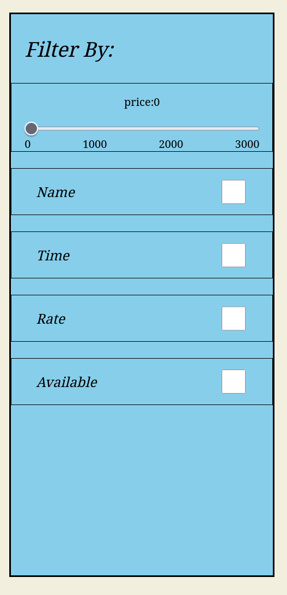

### Activity Log

* **13th May 2026**
  * Questions were distributed.
* **16th May 2026**
  * Added the Sign-In page.
* **17th May 2026**
  * Added Sign-Up page.
  * Connected Node.js authentication with the backend SQL Server.
* **18th May 2026**
  * Combined Auth pages into `auth.html`.
  * Added switch animations.
  * *Note: Original working version is in the 'works' folder.*
* **27th June 2026**
  * Redesigned UI for `book.html`.
  * Introduced the price calculation function.
  * Added `opera` table to SQL DB (Primary Key: `opera_name`) to store seat prices.
  * Implemented backend SQL price routing based on frontend requests.
* **28th June 2026**
  * Completed `sum(price)` calculation (Front-to-Back communication) in `book.html`.
  * Advanced UI/UX design for `main.html` and `search.html`.
* **29th June 2026**
  * Added `localStorage` to pass search inputs from `main.html` to `search.html`.
  * Deployed Filterbox v1.0.1.
  
* **30th June 2026**
  * Started development on the payment page (`pay.html`).
  * Managed SQL DBMS data recording via JS fetch/receive.
* **1st July 2026 (Wed)**
  * Redesigned DBMS tables to fix **3NF violations**.
  * Optimized data storage distribution.
  * *Upcoming:* ER diagram and deep analysis of the DBMS tables will be conducted before Sunday, July 5th.
* **2nd July 2026**
  * created the v1.0.0 ER diagram addressing the sql table:
  '


* **22nd July 2026**
  * Add hash and salt algorithm to the backend `serv.js` to encrypt passwords.
  * Add password validation checks on sign-up including:
    * Must include at least 1 uppercase letter
    * Must include at least 1 lowercase letter
    * Must include at least 1 special character
    * Must include at least 1 number
    * Length must be 8 or more characters
  * Start working on reset password page (improve ux as user may forget their password and are urgent to reset them)


* **23rd july 2026**
  * user who sign up now will receive a verification email to verify if they are signing up an account
    * ***with special thanks to the service provided by `https://app.mailersend.com`***
* **24th July 2026**
  * fixed problem of the link included inside the email for redirection purposes:
    * port of the link should be `3000`(express module port) instead of `5500`(live server port)
  * **added vast amount of `console.log()` in serv.js in order to record log in the terminal for debug purposes**
    * *receive verification email now is completely functional*
    * test account:
      * id: `a`
      * email: `azusaring@gmail.com`
      * pwd: `Aa714714!`

* **25th July 2026** 
  * Connect front-end search page `search.js` with backend `serv.js` in order to update opera-related data dynamically.
  * Implement **Merge Sort** for "sort by name" and **Insertion Sort** for "sort by show_time" in `search.html`,more algorithms will be implemented in the future *(est. <=2 days)*
    * To support the front-end search page, new columns were added to the `opera` table in the database:
      * **Original version:**
        ```sql
        CREATE TABLE IF NOT EXISTS opera (
            opera_id SERIAL PRIMARY KEY
        );
        ```
      * **Updated version:**
        ```sql
        CREATE TABLE IF NOT EXISTS opera (
            opera_id SERIAL PRIMARY KEY,
            opera_name VARCHAR(30),
            show_time TIMESTAMP DEFAULT '2009-06-29 19:30:00',
            rate DECIMAL(3,1) DEFAULT 5.0 CHECK(rate <= 10.0),
            duration INT DEFAULT 150
        );
        ```
    * All database updates were executed using `ALTER TABLE ADD COLUMN` and `UPDATE TABLE` statements.
    * To support the search page requirements, the sorting algorithms in `sort.js` have been updated with specialized versions *(using feature-descriptive suffixes)*

* **26th july 2026**
  * implement sort algorithms on `name`,`price`,`rate`,`time` in `search.html`


* **27th July 2026**
  * The *`Levenshtein Distance`* algorithm is going to be implemented in search.html, this algorithm is for fuzzy search:
    * Users no longer need to ensure the spelling is perfectly correct when searching for specific terms.
      * Configured the algorithm to calculate the best-fit answer independently and rearrange the content dynamically.
* ***29th July, 2026***
  * Applied Quick Sort to rank weights generated by the `Levenshtein` algorithm.
  * Implemented an **"exact match first"** rule (e.g., prioritizing results containing 'a') to improve UX and search relevance.
  * By localstorage.setItem()&getItem(), content selected by user in search.html now will be able to be inherit and show in book.html

* 30th July 2026
  * add time display function in search.html
  * add function:
    * during 00:00:00-12:00:00 system'll adopt price plan 1, during 12:00:01-23:59:59 system'll adopt plan 2
  * test account:
    * name:alpha
    * pwd:Aa714714!
    

* ***1st Aug 2026***
  * add more content data in sql in order to fir the basic requirement of the project


* ### ***2nd Aug 2026***

  * ### `search.html`:

    *  Eliminated manual updates to the element for opera content; `serv.js` now dynamically fetches and renders this data directly from the SQL database.
    *  Successfully implemented full functionality for the `Previous Page` and `Next Page` navigational elements.
    *  Integrated keyboard listener events, enabling users to ***transition between pages*** using the ***left and right arrow keys***.

  * ### `settings.html` & `pay.html`:

    *  Provisions made for the upcoming payment gateway by architecture mapping and deploying `wallet` and `wallet_transaction` tables.
    *  Refactored the registration pipeline to ***automatically instantiate*** a corresponding row in the wallet table upon user sign-up.
    *  Designed and deployed a `gift-code tracking table` to manage unique keys, usage statuses, and balance top-ups.
    *  Programmed client-side logic to handle `code` redemption and adjust database account balances.
    *  Achieved 50% feature completion for the `settings.html` interface.
    *  Bundled a helper `utility toolkit package` into the workspace to expedite object generation and runtime debugging.
      * `dev's page` pwd: **aaaa**

* ***3rd Aug 2026***:
  * **Auth**: Mandatory user signup and verification enforced prior to order placement; payments require database-backed `wallet` balance linked via foreign key `uid` (`user_infor`).
  * **Frontend (`pay.html`)**: Order review interface displaying selected opera details, seat classes, time-based pricing (`getPricePlan()`), and total sum price (`sum_fee`).
  * **Backend Payment & Ticketing Pipeline**:
  * **Atomicity**: Initiated database transaction via `BEGIN`.
  * **Concurrency Lock**: Executed row-level lock via `SELECT balance FROM wallet WHERE uid = $1 FOR UPDATE`.
  * **Balance Validation**: Evaluated `wallet.balance < sum_fee`; if insufficient, executed `ROLLBACK` and aborted.
  * **Wallet Deduction**: Executed `UPDATE wallet SET balance = balance - sum_fee WHERE uid = $1`.
  * **Ledger Logging**: Inserted audit record into `wallet_transaction` (`tx_type = 'DEBIT'`, deduction amount, running balance).
  * **Order Generation**: Inserted record into `orders` (`uid`, `sum_fee`, `transac_status`) to generate `order_id`.
  * **Ticket Generation**: Inserted records into `ticket` linked to `order_id` to generate unique `ticket_id` identifiers.
  * **Finalization**: Executed `COMMIT`.
  * ##### main progress line is done, further functions will be added in upcoming updates.


* ***4th&5th Aug 2026:***
  * first attempt on deploying the project online but failed;

* ***6th Aug 2026***
  * users now are allowed to reset their password via a reset email in case they forget them.
  * `serv.js` now is reconstructed(i.e. modulization) into
    * `serv-config.js`, to store configurations (e.g. database, emailsender)
    * `serv-utils.js` , to sotre sub-functions
    * `serv-auth.js`  , to store user_related codes
    * `serv.main.js`  , to store the main progress code
    * `serv.js`(*new*), to initialze and start the backend server

